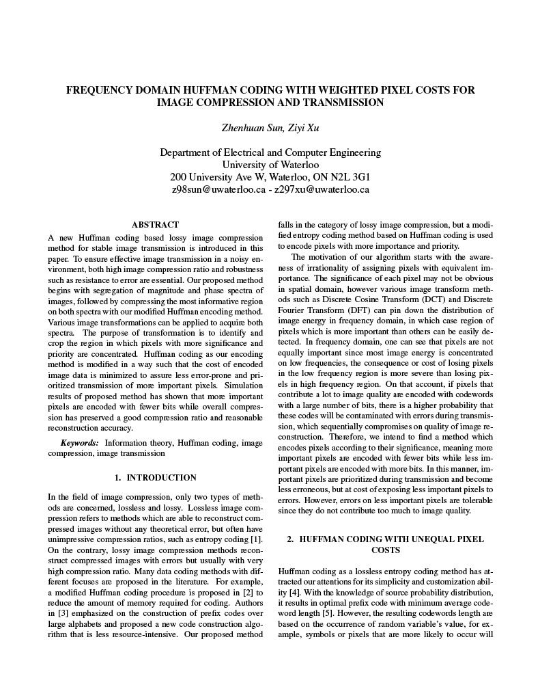
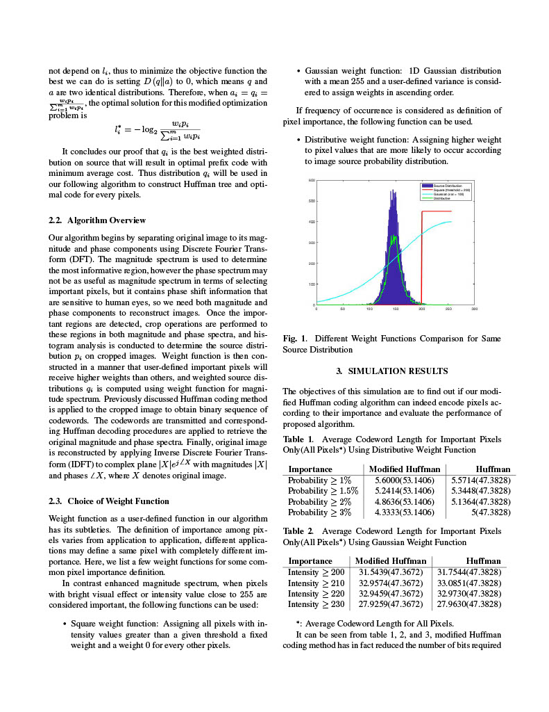
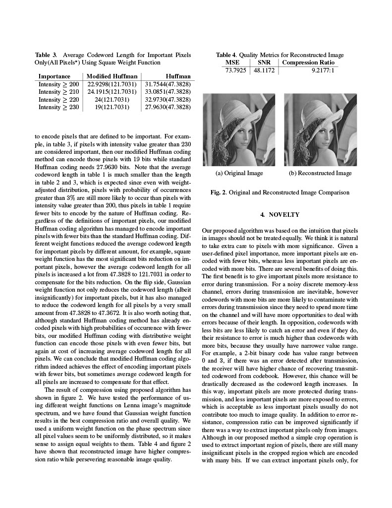

# Frequency Domain Huffman Coding With Unequal Pixel Costs

A research on applying modified Huffman coding with unequal pixel costs to frequency domain image for stable image compression and transmission.

